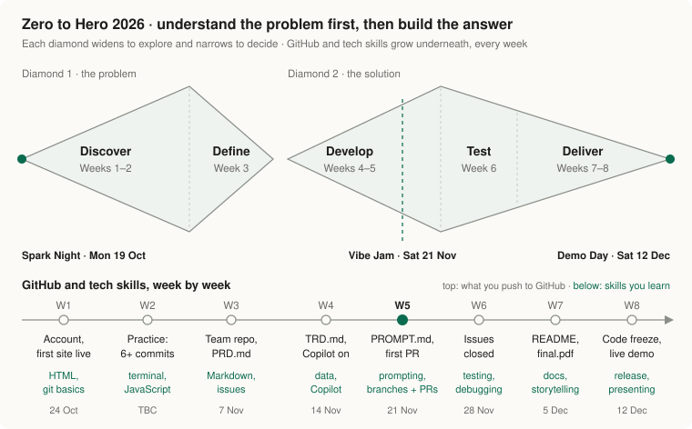

[← Back to Zero to Hero](README.md)

# 🌴 How Zero to Hero works

Hecho en Osa · Zero to Hero 2026 takes builders aged 11–17 from "what's a terminal?" to a real product, live on the internet, in 8 weeks. You don't need to know how to code. You need an idea, a person you want to help, and a few hours a week.

## The idea behind it

Most first projects fail the same way: someone builds a beautiful thing nobody needs. So we split the 8 weeks into two halves, drawn as two diamonds.

- **Diamond 1 · the problem.** First you go wide and talk to real people. Then you narrow down to ONE problem worth solving.
- **Diamond 2 · the solution.** First you go wide again and try ways to build it. Then you narrow down to one product that works, and you show it.

Underneath both diamonds, every single week, you're learning GitHub and real tech skills. By Demo Day you'll have used the same tools working engineers use.

## The flow, phase by phase

### 1 · Discover · Weeks 1–2
**The question:** who has a real problem?

You set up GitHub, put your first website online, and write down your idea. Then you go and talk to people. At least two real interviews, with real quotes.

- **You make:** your first website, `my-idea.md`, `discover.md` with interview notes
- **On GitHub:** your account, your first commits, your first issue
- **Skills:** GitHub setup (Week 1), VS Code (Week 2)
- **You can move on when:** you have a real quote from a real person about a real problem

### 2 · Define · Week 3
**The question:** what exactly are we building, and what are we *not* building?

You form a team, draw your screens on paper, and write your **PRD**: who it's for, their problem, and the ONE thing your product must do.

- **You make:** a persona, paper screens, `PRD.md`
- **On GitHub:** your team repo, Markdown, issues
- **Checkpoint 1 · make it smaller:** one sentence, one thing
- **You can move on when:** your PRD names ONE thing that must work

### 3 · Develop · Weeks 4–5
**The question:** how will we build it?

In Week 4 you write your **TRD**: every screen, every piece of data, and the tests that prove it works. This is also when AI joins the team. You set up Copilot and learn what AI is, and what it isn't.

In Week 5 you learn how a good prompt is built and turn your PRD and TRD into `PROMPT.md`. Then, at the **Vibe Jam on Sat 21 Nov**, everyone builds together for the first time with AI.

- **You make:** `TRD.md`, `PROMPT.md`, your first working screens
- **On GitHub:** branches, pull requests, one issue per screen
- **Skills:** data, Copilot, prompting
- **Checkpoint 2 · TRD + AI ready**
- **You can move on when:** the ONE thing works from start to finish, on a phone

### 4 · Test · Week 6
**The question:** does it work for someone who isn't us?

You build the remaining screens, test every line of your TRD, and hand your phone to someone you interviewed. You watch. You don't explain. Then you fix what broke.

- **You make:** a working product, a list of bugs, fixes
- **On GitHub:** issues closed by pull requests
- **Skills:** testing, debugging
- **Checkpoint 3 · make it good**
- **You can move on when:** someone outside your team used it, and you fixed the top problems

### 5 · Deliver · Weeks 7–8
**The question:** can we explain it and show it?

You write your README in your own words, make 5 slides, and rehearse a 3-minute demo. Code freezes on **Thu 10 Dec at 8 pm**. On **Demo Day, Sat 12 Dec**, every team presents.

- **You make:** `README.md`, `presentation/final.pdf`, a 3-minute demo
- **On GitHub:** your final version, frozen
- **Skills:** writing docs, telling a story, presenting
- **Checkpoint 4 · rehearse the demo**

## How the documents connect

Each document feeds the next one. That's why we write the first two by hand.

| Week | Document | What it answers |
|---|---|---|
| 3 | `PRD.md` | **What** are we building, and for whom? |
| 4 | `TRD.md` | **How** will we build it, and how do we test it? |
| 5 | `PROMPT.md` | What do we tell the AI? Built from the PRD and TRD. |
| 7 | `README.md` | What did we build, how does it work, and what did we use? |

Your PRD and TRD *are* your prompt. The AI can only build what you wrote.

## Every week, the same rhythm

| When | What happens |
|---|---|
| **Sunday evening** | The new week opens here, after the 8 pm update deadline |
| **During the week** | Watch the videos, work through `assignment.md` |
| **Saturday** | Build Hour at Bitcoin Jungle: workshops, help, mentors |
| **Sunday, 8 pm** | Post your weekly update (Weeks 1–2: your Wall issue in hello-osa · Weeks 3–8: your team issue) |
| **Monday** | Mentors read every update and reply |

Each week has two pages: a short **overview** (`README.md`) with your mission and checklist, and the **assignment** (`assignment.md`) with every step.

## The big days

| Date | Moment |
|---|---|
| Mon 19 Oct | ⚡ **Spark Night.** Week 1 opens. |
| Sat 21 Nov | 🎉 **Vibe Jam.** Everyone builds with AI for the first time. |
| Thu 10 Dec, 8 pm | 🧊 **Code freeze.** What's on GitHub is what you show. |
| Sat 12 Dec | 🏆 **Demo Day.** Location to be announced. |

## Who helps you

- **Weeks 1–4:** mentors rotate. Ask whoever is in front of you at Build Hour.
- **From Week 5:** each team has its own mentor.
- **Speakers:** Emilie, Vlad, Lee, Alex, Zamir and Anastasia record short videos and lead Build Hours.

Mentors give you questions, not answers. They won't build it for you. That's the point.

## Already know how to code?

**Experienced builders** don't follow these weeks. Build on your own and submit a README for your project.

## Rules and help

- 📏 [RULES.md](RULES.md): the 5 rules, plus roadmap, interview, team and AI rules
- 🆘 [STUCK.md](STUCK.md): what to do when something breaks
- 💬 Stuck for 10 minutes? Ask in the Hackathon WhatsApp group (Weeks 1–2) or on your team issue (Weeks 3–8).

**¡Hecho en Osa!** 🌴
